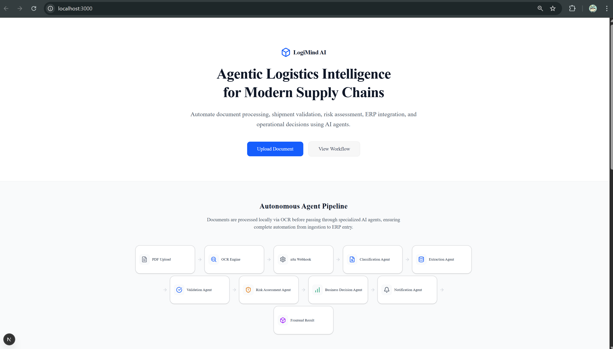
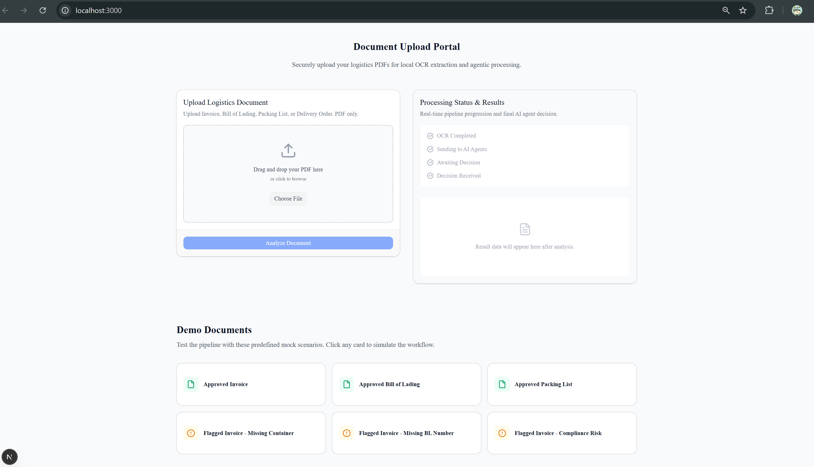
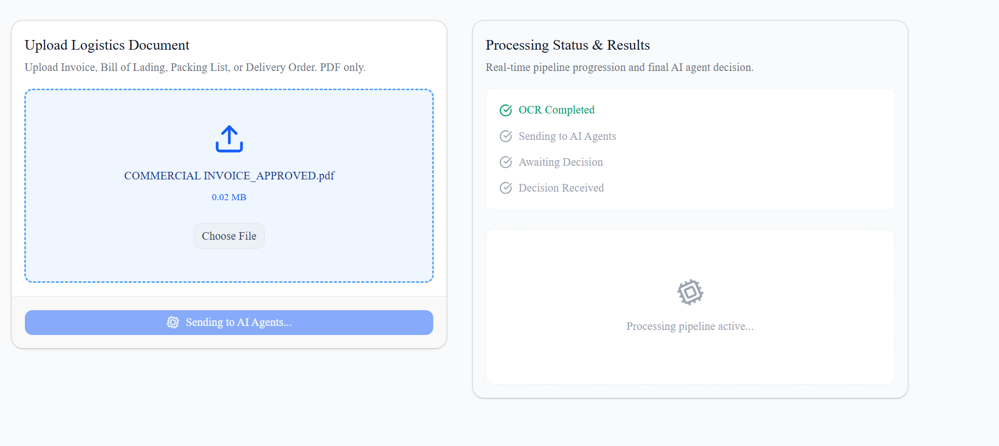
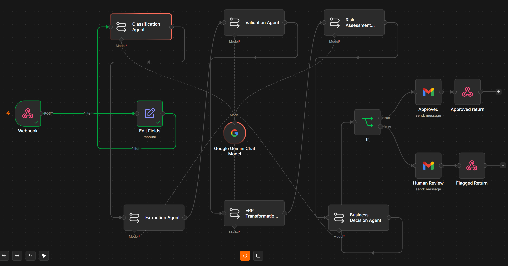
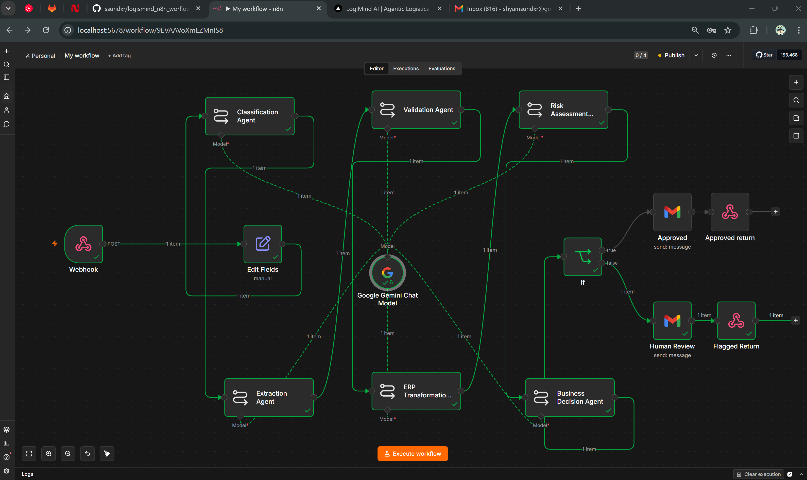
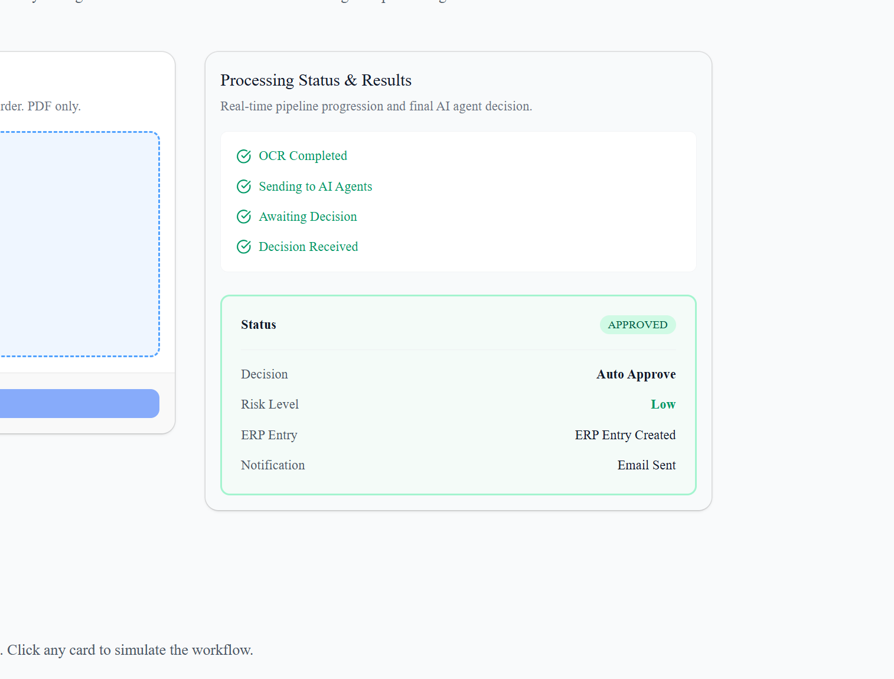
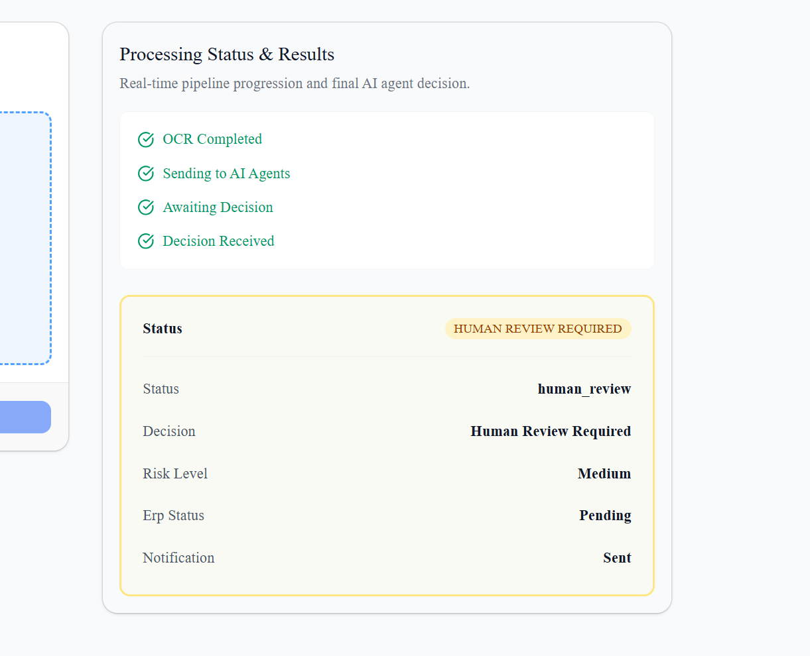
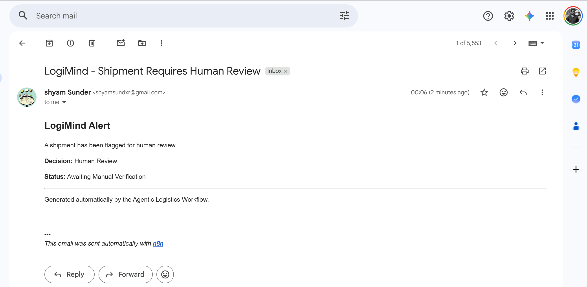

# LogiMind AI
Agentic Logistics Intelligence Platform

LogiMind AI is an end-to-end AI-powered logistics automation platform that transforms document-heavy freight operations into intelligent workflows using multi-agent systems, workflow orchestration, and automated business decisioning.

## Overview

Traditional logistics workflows require manual review of invoices, bills of lading, packing lists, and shipment documents.

LogiMind AI automates this process using a chain of AI agents that:

- Classify logistics documents
- Extract shipment information
- Validate business-critical fields
- Assess operational and compliance risks
- Make approval decisions
- Generate ERP-ready records
- Send automated notifications

## Architecture

```text
PDF Upload
     ↓
OCR Engine
     ↓
n8n Webhook
     ↓
Classification Agent
     ↓
Extraction Agent
     ↓
Validation Agent
     ↓
Risk Assessment Agent
     ↓
Business Decision Agent
     ↓
Conditional Routing
    ↙        ↘
Approved   Human Review
    ↓          ↓
 Gmail      Gmail
    ↓          ↓
Respond to Webhook
     ↓
Frontend Dashboard
```

## Features

### Document Intelligence
- Invoice Classification
- Bill of Lading Detection
- Packing List Recognition
- Delivery Order Classification

### Information Extraction
Extracts:
- Shipper
- Consignee
- Container Number
- Ports
- Cargo Description
- Invoice Number

### Validation Engine
Checks:
- Missing fields
- Invalid shipment metadata
- Port validation
- Invoice verification

### Risk Assessment
Analyzes:
- Operational Risk
- Compliance Risk
- Fraud Indicators

### Decision Engine
Outputs:
- Auto Approve
- Human Review
- Reject

### Notification System
Automated Gmail notifications for:
- Approved shipments
- Human review requests

## Tech Stack
**Frontend:**
- Next.js 15
- TypeScript
- Tailwind CSS
- Shadcn UI

**Workflow Automation:**
- n8n

**AI Models:**
- Google Gemini

**Integrations:**
- Gmail API
- Webhooks

**Deployment:**
- Vercel
- Docker

## Screenshots

**Platform Dashboard**



**Upload Processing**


**AI Workflow**



**Approved Shipment**


**Human Review**


**Email Notifications**


## Business Impact
LogiMind AI demonstrates how Agentic AI can automate logistics operations by combining:
- Prompt Engineering
- Workflow Automation
- Decision Intelligence
- ERP Integration
- Human-in-the-Loop Approval Systems

## Future Enhancements
- Multi-document OCR
- SAP Integration
- Oracle ERP Integration
- RAG-powered Shipment Knowledge Base
- Real-time Logistics Analytics
- Multi-Agent Planning Systems

## Author
**Shyam Sunder**

Built as an AI Solutions Engineering project demonstrating workflow automation, prompt engineering, ERP integration concepts, and agentic AI orchestration.
